<!--
  Perfil de GitHub de Rodri Gonzalez (@SyncraLabs).
  El grid de contribuciones lo re-genera solo el workflow .github/workflows/update-profile-art.yml.
  Para re-tunear el retrato:  python scripts/make_ascii_svg.py source-prepped.png rodri-ascii.svg
  Para editar el panel:       edita ROWS/HOST en scripts/make_info_card.py y ejecutalo.
-->

<table>
<tr>
<td valign="top"></td>
<td valign="top"></td>
</tr>
</table>

## Rodri Gonzalez

**IA para negocios · Automatizaciones & agentes · Creador de contenido**

 

<!-- grid de contribuciones, actualizado a diario por el workflow -->

